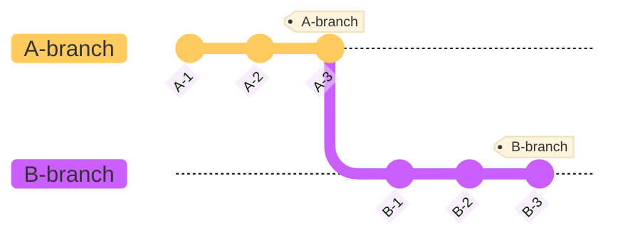
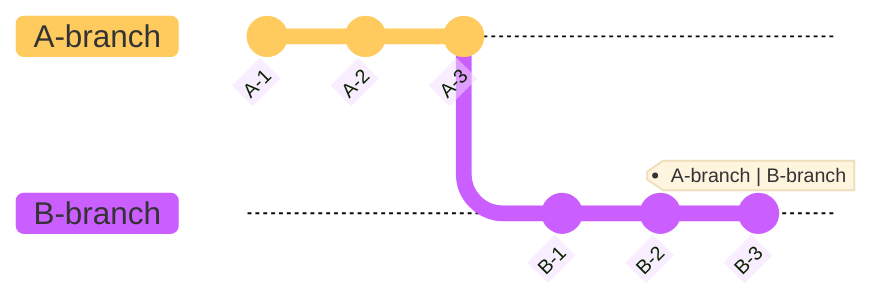
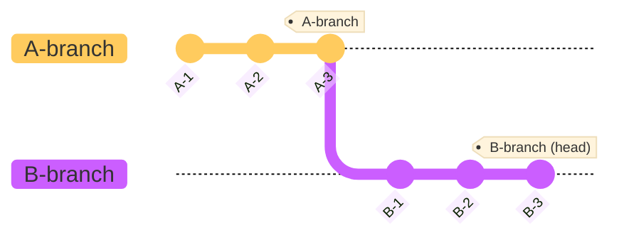
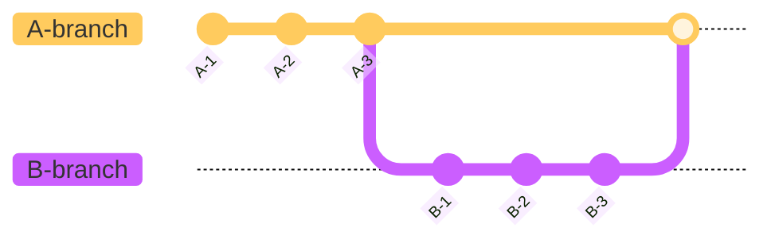

# 1. 소개

원활한 협업을 위한 Git과 Github에서 프로젝트 브랜치 병합 방법에 대해 알아본다.
단순히, 이론을 적는 글이 아닌 해당 레포에서 실습을 진행한다.

# 2. Merge 3가지 방식

병합을 하는 방법으로는 대표적으로 `Merge`, `Squash & Merge`, `Rebase & Merge`가 있다.

## 2.1. Merge

Merge는 기본적인 병합 방식으로, 커밋의 관계에 따라 다르게 동작한다.

-   관계는 2가지가 존재한다.
    -   fast-forward(--ff)
    -   non-fast-forward(--no-ff)
-   옵션이 없는 `Merge` 명령어 실행시
    -   병합하려는 커밋이, 병합되는 커밋에 포함되는 관계인 경우 ff로 동작
    -   병합하려는 커밋이, 병합되는 커밋에 포함되지 않는 관계인 경우 --no-ff로 동작

### 2.1.1. 관계: fast-forward(--ff)

아래와 같이 B-3 커밋이 A-3 커밋의 히스토리 전체를 포함하고 있다.



```
git checkout A-branch
git merge B-branch
```

명령어 실행시, 제일 최근 커밋으로 상태를 같게 만든다.

-   --no-ff와 다르게 병합 커밋을 생성하지 않는다.



### 2.1.2. 관계: non-fast-forward(--no-ff)

아래와 같이



```
git checkout A-branch
git merge B-branch
```


