# Merge와 fast-forward

## 1. Merge

Merge는 기본적인 병합 방식으로, 커밋의 관계에 따라 다르게 동작한다.

-   커밋 관계 : 병합의 주체 커밋이 병합의 목적 커밋에 포함 관계 여부
-   옵션은 2가지가 존재한다.
    -   fast-forward(--ff)
    -   non-fast-forward(--no-ff)
-   옵션이 없는 `Merge` 명령어 실행시
    -   병합하려는 커밋이, 병합되는 커밋에 포함되는 관계인 경우 ff로 동작
    -   병합하려는 커밋이, 병합되는 커밋에 포함되지 않는 관계인 경우 --no-ff로 동작

<br />

## 2. fast-forward(--ff)

#### 2.1. 포함 관계인 경우

-   관계: `A-3(주체) ⊂ B-3(목적)`
-   실행: `git merge --ff B-branch`
-   결과: 목적 커밋과 같은 상태로 진행된다.
-   특징: 병합 커밋을 만들지 않는다.

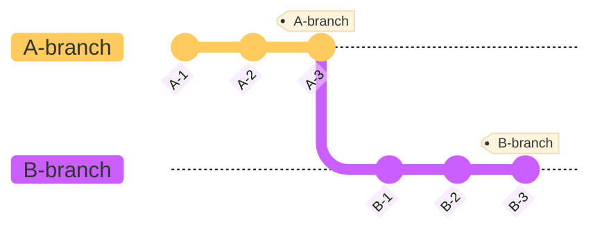

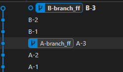

```
git checkout A-branch
git merge --ff B-branch
```

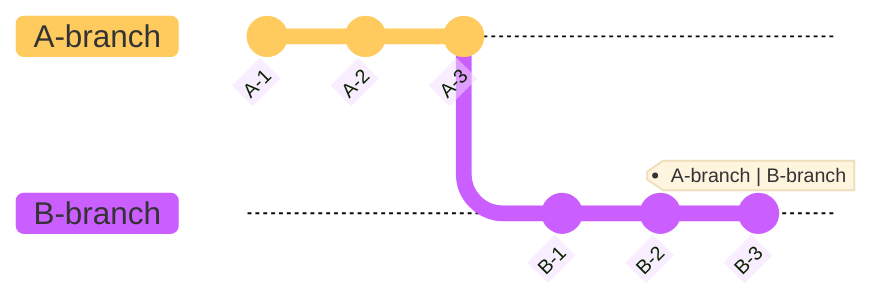

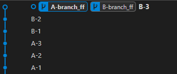

<br />

#### 2.2. 포함 관계가 아닌 경우

-   관계: `A-3(주체) ⊄ B-3(목적)`
-   실행: `git merge --ff B-branch`
-   결과: 병합 커밋을 생성한다.

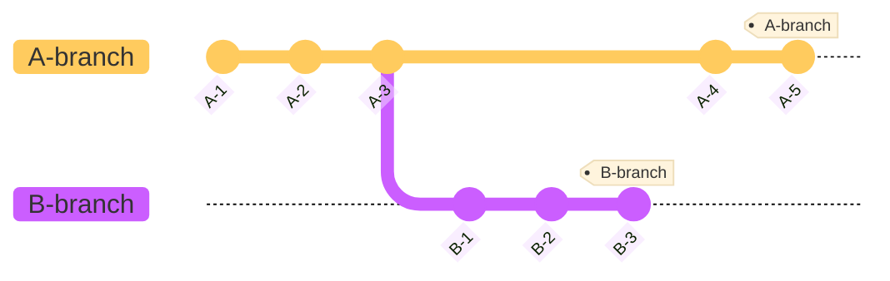

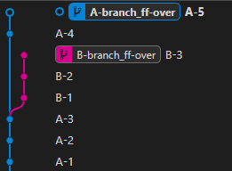

```
git merge --ff B-branch
```

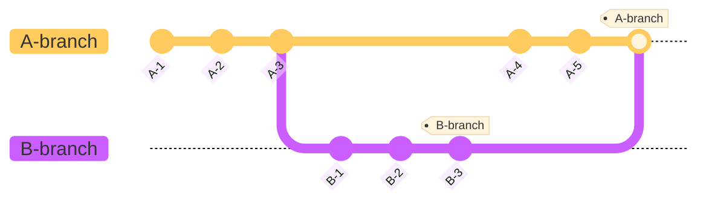

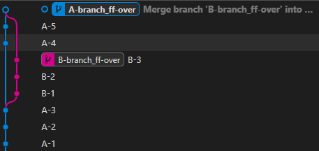

<br />

## 3. non-fast-forward(--no-ff)

#### 3.1. 포함 관계인 경우

-   관계: `A-3(주체) ⊂ B-3(목적)`
-   실행: `git merge --no-ff B-branch`
-   결과: 병합 커밋을 만든다.


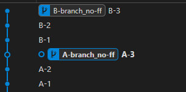

```
git checkout A-branch
git merge --no-ff B-branch
```

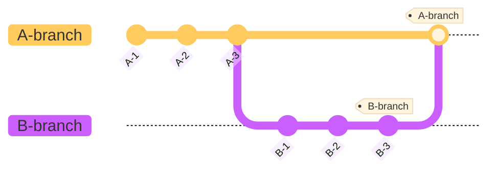

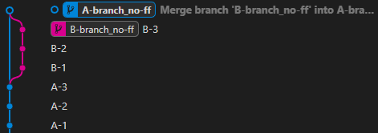

<br />

#### 3.2. 포함 관계가 아닌 경우

-   관계: `A-3(주체) ⊄ B-3(목적)`
-   실행: `git merge --no-ff B-branch`
-   결과: 병합 커밋을 생성한다.


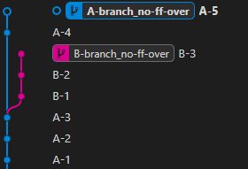

```
git checkout A-branch
git merge --no-ff B-branch
```


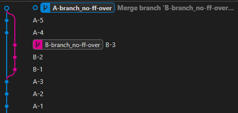

<br />

## 4. 정리

-   옵션과 관계에 따른 병합 커밋 생성 여부

| 옵션\관계 | 주체 ⊂ 목적 | 주체 ⊄ 목적 |
| --------- | ----------- | ----------- |
| `--ff`    | ❌          | ✅          |
| `--no-ff` | ✅          | ✅          |
| -         | ❌          | ✅          |
