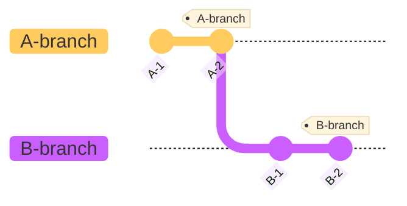
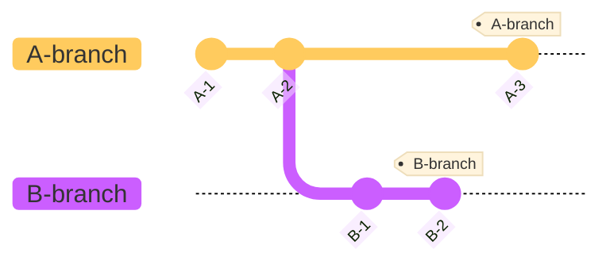
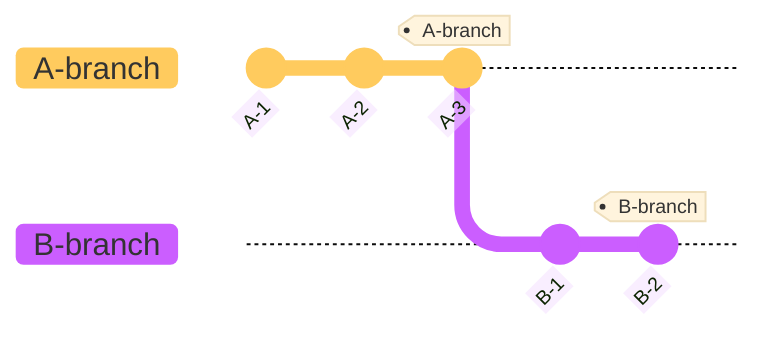
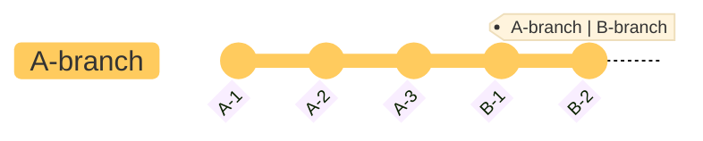

# Rebase

Rebase는 Branch의 Base를 변경한다는 개념이다.
Rebase는 Branch간에 Base가 달라야 실행 가능하다.

#### 1. 포함 관계인 경우

-   아래 예시와 같이 Base가 상대 branch의 커밋이 최신인 경우 (포함 관계)는 Base를 재조정 할 필요가 없기 때문이다. (B에서 A로 rebase하는 경우)
-   다만, 해당 상황에서 A에서 B로 rebase하는 경우 A-branch에서 앞선 B-branch를 rebase하는 경우 fast-forward를 작동한 것과 같이 B-2로 A-branch,B-branch 모두 향한다.



#### 2. 포함 관계가 아닌 경우

-   Base가 다르기 때문에 실행 가능하다.



```
git checkout B-branch
git rebase A-branch
// 아래 그림과 같이 목적(B) 커밋들을 주체(A) 최신 커밋으로 베이스를 변경한다.
```



```
git checkout A-branch
git merge B-branch
// fast-forward를 실행으로 상태를 같게 만든다.
```


