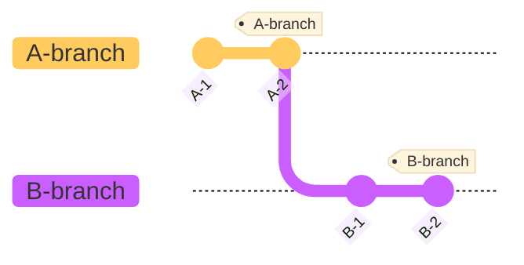
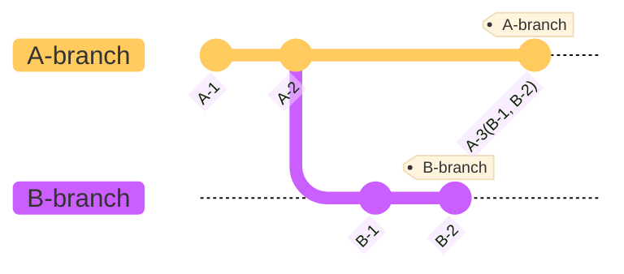
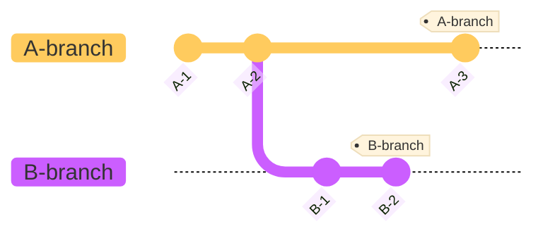
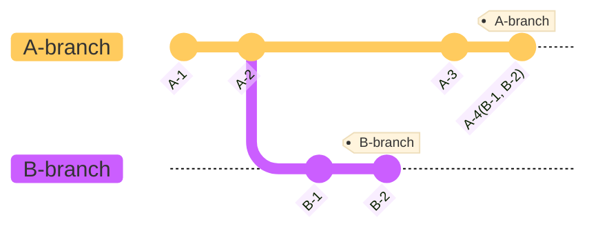

# Squash

여러 개의 커밋을 하나로 합치는 기능을 말한다.

-   병합할 목적 커밋들을 전부 하나의 커밋으로 만들어 주체 커밋에 새로운 병합 커밋을 생성한다.
-   커밋 히스토리를 깔끔하게 만들기 위해 사용한다.

#### 1. 포함 관계인 경우

-   관계: `A-3(주체) ⊂ B-3(목적)`
-   실행: `git merge --squash B-branch`
-   결과: 목적 커밋들이 합쳐진 변경이 스테이징된다.



```
git checkout A-branch
git merge --squash B-branch
// 목적 커밋들이 합쳐진 변경이 스테이징 됨
git commit -m "A-3(B-1, B-2)"
```



#### 2. 포함 관계가 아닌 경우

-   관계: `A-3(주체) ⊄ B-3(목적)`
-   실행: `git merge --squash B-branch`
-   결과: 목적 커밋들이 합쳐진 변경이 스테이징된다.



```
git checkout A-branch
git merge --squash B-branch
// 목적 커밋들이 합쳐진 변경이 스테이징 됨
git commit -m "A-4(B-1, B-2)"
```


