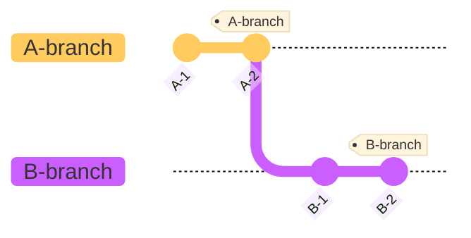
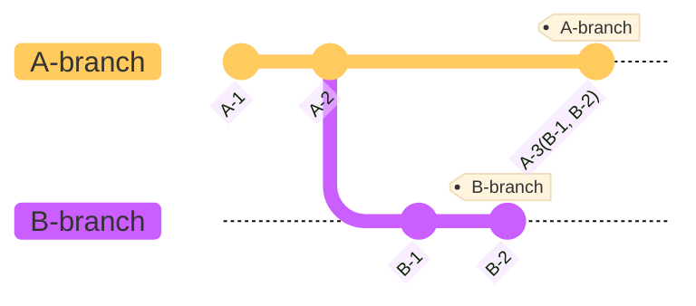

# Squash

여러 개의 커밋을 하나로 합치는 기능을 말한다.

-   병합할 목적 커밋들을 전부 하나의 커밋으로 만들어 주체 커밋에 새로운 병합 커밋을 생성한다.

## 포함 관계인 경우


```mermaid
%%{init: { 'logLevel': 'debug', 'theme': 'base', 'gitGraph': {'showBranches': true, 'showCommitLabel':true,'mainBranchName': 'A-branch'}} }%%
      gitGraph
        commit id: "A-1"
        commit id: "A-2" tag: "A-branch"
        branch B-branch
        commit id: "B-1"
        commit id: "B-2" tag: "B-branch"
```

```
git checkout A-branch
git merge --squash B-branch
```


```mermaid
%%{init: { 'logLevel': 'debug', 'theme': 'base', 'gitGraph': {'showBranches': true, 'showCommitLabel':true,'mainBranchName': 'A-branch'}} }%%
      gitGraph
        commit id: "A-1"
        commit id: "A-2"
        branch B-branch
        commit id: "B-1"
        commit id: "B-2" tag: "B-branch"
        checkout A-branch
        commit id: "A-3(B-1, B-2)" tag: "A-branch"
```
